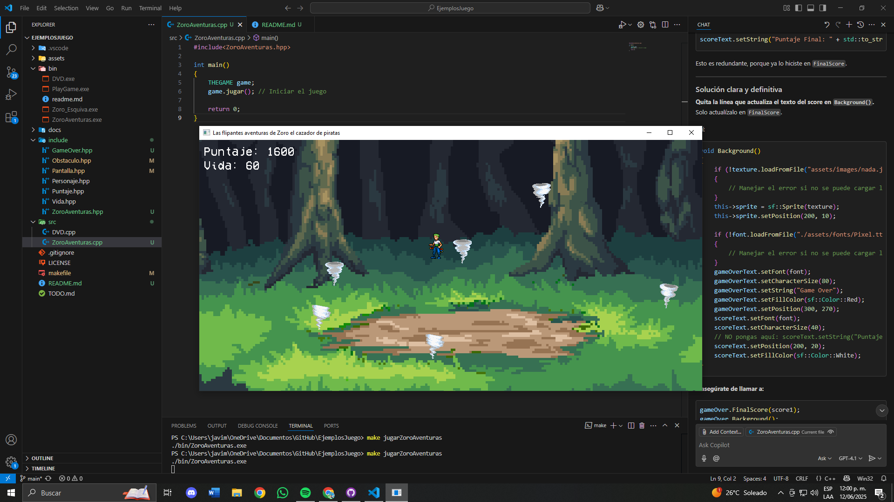

# LAS FLIPANTES AVENTURAS DE ZORO EL CAZADOR DE PIRATAS

## MANUAL DE USUARIO
Escribir en la terminal el siguiente codigo: make runZoro_Esquiva
Presionar Enter

Al iniciar el juego aparecerá una pantalla de inicio, presiona enter para comenzar el juego.

### A JUGAR
controles:
- Mover abajo: tecla ↓ 
- Mover ariiba: tecla ↑ 
- Mover derecha: tecla → 
- Mover izquierda: tecla ← 

Reglas:
1. Evita los tornados a toda costa o la vida de zoro comenzará a bajar.
2. Aparecerán tornados cada 2 segundos en la pantalla.
3. Cuentas con 100 de vida, pero cada que un tornado te toque te bajará 10 de vida.
4. Aparecerán tornados cada 2 segundos en la pantalla.
5. Mientras mas tiempo sobrevivas tu puntaje comenzará a incrementar.
6. Consigue tu record de puntuación.

## Imagenes de demostración

## MANUAL DE DESARROLLADOR

El proyecto esta desarrollado sobre MinGW64 utilizando Msys2
y como editor se esta utilizando Visual Studio Code.

### Prerequisitos

[Instalar las herramientas necesarias](./docs/herramientas.md)

[Instalar las Extensiones VSCode](./docs/extensiones.md)

[Instalar las librerias](./docs/librerias.md)

[Clonar el repositorio](./docs/fork.md)

### Como ejecutar los ejemplos

Instalar todas las dependencias descritas arriba y dentro de una terminal de vscode ejecutar:

>make JugarZoroAventuras

En la terminal de vscode

